# 🚀 Olist-BatchFlow — End-to-End E-Commerce Data Engineering Pipeline

> **An end-to-end batch data engineering pipeline that transforms raw Olist e-commerce data into a structured PostgreSQL data warehouse and delivers an interactive analytics dashboard through Streamlit Cloud.**

[](https://www.python.org/)
[](https://www.postgresql.org/)
[](https://pola.rs/)
[](https://www.sqlalchemy.org/)
[](https://streamlit.io/)
[](https://supabase.com/)
[](https://github.com/)

---

## 🔗 Project Links

**Developer:** Shubham Tyagi

* 💼 [LinkedIn](https://www.linkedin.com/in/shubham-tyagi-947b49400/)
* 💻 [GitHub](https://github.com/ShubhTyagi1616)
* 📂 [Project Repository](https://github.com/ShubhTyagi1616/Olist-BatchFlow)
* 🚀 [Live Dashboard:](https://olist-batchflow-nthhq7wksqr2eugqjnrqtr.streamlit.app)

---

# 📌 Project Overview

**Olist-BatchFlow** is an end-to-end **batch ETL and analytics pipeline** built using the Brazilian Olist e-commerce dataset.

The project demonstrates how raw transactional data can be transformed into an analytics-ready warehouse through a structured data engineering workflow.

The pipeline:

1. Extracts raw CSV datasets.
2. Processes data using **Python + Polars**.
3. Loads raw data into a PostgreSQL **staging layer**.
4. Performs transformations and data modeling.
5. Builds a dimensional warehouse using a **star schema**.
6. Stores the warehouse in **Supabase PostgreSQL**.
7. Exposes the warehouse through an interactive **Streamlit dashboard**.
8. Deploys the analytics application on **Streamlit Community Cloud**.

The project was designed to demonstrate practical Data Engineering concepts including:

* Batch ETL
* Data ingestion
* Data transformation
* PostgreSQL
* Data warehouse modeling
* Star schema
* Fact and dimension tables
* Data quality handling
* SQL analytics
* Python data processing
* Cloud PostgreSQL
* Environment-based configuration
* Dashboard deployment
* Git/GitHub workflow

---

# 🏗️ Architecture

```text
                         ┌──────────────────────┐
                         │   Olist CSV Dataset  │
                         │     Raw Sources      │
                         └──────────┬───────────┘
                                    │
                                    ▼
                         ┌──────────────────────┐
                         │   Extract Layer      │
                         │  Python + Polars     │
                         └──────────┬───────────┘
                                    │
                                    ▼
                    ┌────────────────────────────────┐
                    │       PostgreSQL Staging       │
                    │                                │
                    │  stg_customers                 │
                    │  stg_orders                    │
                    │  stg_order_items               │
                    │  stg_order_payments            │
                    │  stg_order_reviews             │
                    │  stg_products                  │
                    │  stg_sellers                   │
                    │  stg_geolocation               │
                    │  stg_category_translation      │
                    └────────────────┬───────────────┘
                                     │
                                     ▼
                         ┌──────────────────────┐
                         │ Transformation Layer │
                         │   Python + Polars    │
                         │      SQLAlchemy      │
                         └──────────┬───────────┘
                                    │
                                    ▼
                    ┌────────────────────────────────┐
                    │      PostgreSQL Warehouse       │
                    │                                │
                    │      ⭐ Star Schema             │
                    │                                │
                    │  dim_customers                │
                    │  dim_sellers                  │
                    │  dim_products                 │
                    │  dim_date                     │
                    │  fact_orders                  │
                    └────────────────┬───────────────┘
                                     │
                                     ▼
                         ┌──────────────────────┐
                         │  Supabase PostgreSQL │
                         │    Cloud Database    │
                         └──────────┬───────────┘
                                    │
                                    ▼
                         ┌──────────────────────┐
                         │ Streamlit Dashboard  │
                         │                      │
                         │ Sales & Orders       │
                         │ Customer & Seller    │
                         │ Reviews & Status     │
                         │ Data Quality & ETL   │
                         └──────────┬───────────┘
                                    │
                                    ▼
                         ┌──────────────────────┐
                         │ Streamlit Community  │
                         │        Cloud         │
                         └──────────────────────┘
```

---

# 🎯 Business Problem

E-commerce platforms generate data across multiple business processes:

* Customers
* Orders
* Products
* Sellers
* Payments
* Reviews
* Shipping
* Product categories

Raw transactional files are difficult to analyze directly because the information is distributed across multiple datasets.

The goal of this project is to build a reliable batch data pipeline that converts these raw datasets into a centralized analytical data warehouse.

The resulting warehouse enables analysis of:

* Revenue performance
* Order trends
* Product categories
* Seller performance
* Customer distribution
* Order status
* Customer reviews
* Payment values
* Data quality metrics

---

# ⚙️ ETL Pipeline

## 1. Extract

The pipeline reads the Olist CSV datasets using **Polars**.

The extraction layer maintains a centralized file mapping and loads the required datasets into DataFrames.

### Source datasets

| Dataset              | Purpose                                   |
| -------------------- | ----------------------------------------- |
| Customers            | Customer information                      |
| Orders               | Order lifecycle and timestamps            |
| Order Items          | Products and seller information per order |
| Order Payments       | Payment information                       |
| Order Reviews        | Customer review scores                    |
| Products             | Product attributes                        |
| Sellers              | Seller information                        |
| Geolocation          | Location information                      |
| Category Translation | Portuguese → English category mapping     |

---

# 🔄 Transformation

The transformation layer reads data from PostgreSQL staging tables and prepares analytics-ready datasets.

Key transformations include:

### Customer Dimension

Creates a unique customer dimension containing:

* `customer_id`
* `customer_unique_id`
* `customer_city`
* `customer_state`

### Seller Dimension

Creates a seller dimension containing:

* `seller_id`
* `seller_city`
* `seller_state`

### Product Dimension

Combines product information with the category translation dataset.

Includes:

* Product ID
* English product category
* Product weight
* Product dimensions

### Date Dimension

Creates calendar attributes from order timestamps:

* Date
* Year
* Month
* Day
* Weekday

### Orders Fact

Combines:

* Orders
* Order items
* Payments
* Reviews

The resulting fact table contains transactional measures and business attributes required for analytics.

---

# ⭐ Data Warehouse Design

The project uses a **star schema**.

## Fact Table

### `warehouse.fact_orders`

**Grain:**

> One row represents an order item.

Key columns include:

```text
order_id
order_item_id
customer_id
seller_id
product_id
order_purchase_date
order_status
price
freight_value
payment_value
review_score
```

---

# Dimension Tables

### `warehouse.dim_customers`

Customer attributes.

### `warehouse.dim_sellers`

Seller attributes.

### `warehouse.dim_products`

Product and category attributes.

### `warehouse.dim_date`

Calendar attributes for time-based analysis.

---

# 📊 Warehouse Scale

The current pipeline processes approximately:

| Entity                  |    Rows |
| ----------------------- | ------: |
| Customers               |  99,441 |
| Orders                  |  99,441 |
| Order Items / Fact Rows | 112,650 |
| Products                |  32,951 |
| Sellers                 |   3,095 |
| Reviews                 |  99,224 |
| Payment Records         | 103,886 |
| Date Dimension          |     634 |

The warehouse contains **100K+ transactional records** at the fact level.

---

# 🧹 Data Quality & Engineering Considerations

The pipeline handles several real-world data engineering considerations.

### Duplicate Handling

Dimension-building transformations use uniqueness constraints to prevent duplicate dimension records.

Example:

```python
.unique(subset=["customer_id"])
```

---

### Review Deduplication

The Olist review dataset can contain multiple records associated with the same order.

The transformation layer deduplicates reviews before joining them to the fact table.

---

### Payment Aggregation

Multiple payment records can exist for a single order.

Payments are therefore aggregated at the order level before joining with the fact data.

```text
Multiple payments
       ↓
Group by order_id
       ↓
SUM(payment_value)
       ↓
Order-level payment value
```

---

### Null Handling

The transformation process preserves nullable business attributes where missing values are meaningful rather than blindly replacing all missing values.

---

### Referential Relationships

The warehouse model maintains relationships between:

```text
fact_orders
     │
     ├── customer_id → dim_customers
     ├── seller_id   → dim_sellers
     ├── product_id  → dim_products
     └── date        → dim_date
```

---

# 🗄️ PostgreSQL Layering

The database is organized into two logical layers.

## Staging Layer

```text
staging.stg_customers
staging.stg_orders
staging.stg_order_items
staging.stg_order_payments
staging.stg_order_reviews
staging.stg_products
staging.stg_sellers
staging.stg_geolocation
staging.stg_category_translation
```

The staging layer represents the ingested source data.

## Warehouse Layer

```text
warehouse.dim_customers
warehouse.dim_sellers
warehouse.dim_products
warehouse.dim_date
warehouse.fact_orders
```

The warehouse layer contains transformed, analytics-ready data.

---

# 🔐 Configuration & Security

Database credentials are **not hardcoded in the source code**.

### Local development

Credentials are loaded through:

```text
.env
```

Example:

```text
DB_HOST=
DB_PORT=
DB_NAME=
DB_USER=
DB_PASSWORD=
```

The `.env` file is excluded from Git using `.gitignore`.

### Streamlit Cloud

Production credentials are stored using **Streamlit Secrets**.

```text
Streamlit Cloud
      ↓
Streamlit Secrets
      ↓
Supabase PostgreSQL
```

This keeps database credentials outside the public GitHub repository.

---

# 📈 Streamlit Analytics Dashboard

The project includes a multi-page analytics dashboard.

## 📊 Overview

Provides a high-level summary of the e-commerce dataset and key business metrics.

---

## 💰 Sales & Orders

Provides analysis of:

* Revenue
* Orders
* Order status
* Monthly performance
* Product categories
* Seller performance
* Year-based filtering

Interactive filters allow users to explore different periods and order statuses.

---

## 👥 Customer & Seller

Provides customer and seller-level analysis including:

* Customer distribution
* Seller activity
* Geographic information
* Seller performance

---

## ⭐ Reviews & Status

Provides insights into:

* Review scores
* Average review score
* Order status
* Review distribution

---

## 🧪 Data Quality & ETL

Provides visibility into pipeline-related metrics and warehouse data quality.

---

# ☁️ Cloud Deployment

The dashboard is deployed using:

**Streamlit Community Cloud**

The application connects directly to:

```text
Streamlit Cloud
       ↓
Supabase PostgreSQL
       ↓
Warehouse Tables
```

This means the dashboard does not depend on the local development machine or local CSV files after deployment.

---

# 🛠️ Technology Stack

## Programming

* Python 3.10

## Data Processing

* Polars
* Pandas
* NumPy

## Database

* PostgreSQL
* Supabase

## Database Connectivity

* SQLAlchemy
* psycopg2

## Analytics & Visualization

* Streamlit
* Plotly

## Development & Version Control

* Git
* GitHub
* VS Code
* Python Virtual Environment

## Deployment

* Streamlit Community Cloud

---

# 📁 Project Structure

```text
Olist-BatchFlow/
│
├── data/
│   └── raw/
│       └── Olist CSV datasets
│
├── src/
│   ├── __init__.py
│   ├── config.py
│   ├── extract.py
│   ├── transform.py
│   └── load.py
│
├── sql/
│   ├── staging/
│   └── warehouse/
│
├── streamlit_app/
│   ├── app.py
│   ├── db.py
│   ├── queries.py
│   ├── utils.py
│   │
│   └── pages/
│       ├── customer_&_seller.py
│       ├── Data_Quality_&_ETL.py
│       ├── reviews_&_status.py
│       └── sales_&_orders.py
│
├── .env.example
├── .gitignore
├── requirements.txt
└── README.md
```

---

# ▶️ Run the Project Locally

## 1. Clone the repository

```bash
git clone https://github.com/ShubhTyagi1616/Olist-BatchFlow.git
```

```bash
cd Olist-BatchFlow
```

---

## 2. Create a virtual environment

```bash
python -m venv venv
```

### Windows

```bash
venv\Scripts\activate
```

---

## 3. Install dependencies

```bash
pip install -r requirements.txt
```

---

## 4. Configure environment variables

Create a `.env` file in the project root:

```text
DB_HOST=
DB_PORT=
DB_NAME=
DB_USER=
DB_PASSWORD=
```

Use your PostgreSQL/Supabase database credentials.

**Never commit `.env` to GitHub.**

---

# ▶️ Run the ETL Pipeline

The complete batch pipeline can be executed with:

```bash
python -m src.load
```

The pipeline performs:

```text
Extract
   ↓
Load to Staging
   ↓
Read Staging
   ↓
Transform
   ↓
Build Dimensions & Fact
   ↓
Load Warehouse
```

---

# 📊 Run the Streamlit Dashboard

From the project root:

```bash
streamlit run streamlit_app/app.py
```

The dashboard will open in your browser.

---

# 🔍 Example Analytical Questions

The warehouse and dashboard can answer questions such as:

### Sales

* What is the monthly revenue trend?
* How many orders were placed?
* Which categories generate the most revenue?
* Which sellers contribute the most sales?

### Customers

* How many customers are present?
* Which states have the highest customer concentration?
* How is customer activity distributed?

### Reviews

* What is the average review score?
* How do review scores vary by order status?
* What percentage of orders have review information?

### Orders

* What are the most common order statuses?
* How does order volume change over time?
* What is the relationship between order value and freight cost?

---

# 💡 Key Data Engineering Concepts Demonstrated

This project demonstrates practical implementation of:

```text
Batch ETL
│
├── Data Extraction
├── Data Ingestion
├── Staging Layer
├── Data Transformation
├── Data Cleaning
├── Deduplication
├── Aggregation
├── Data Modeling
├── Star Schema
├── Fact & Dimension Tables
├── PostgreSQL
├── Cloud Database
├── SQL Analytics
├── Environment Configuration
├── Secrets Management
├── Git Version Control
└── Cloud Deployment
```

---

# 🚀 Engineering Highlights

### 1. Layered Data Architecture

Separates raw ingestion from analytics-ready warehouse data.

### 2. Dimensional Modeling

Uses a star-schema approach with a clearly defined fact-table grain.

### 3. Batch Processing

The pipeline processes multiple related datasets in a controlled ETL workflow.

### 4. Transaction-Level Fact Modeling

The fact table is modeled at the **order-item grain**, allowing detailed transactional analysis.

### 5. Cloud Database Integration

Uses Supabase PostgreSQL as the cloud-hosted analytical database.

### 6. Production-Oriented Configuration

Database credentials are separated from source code using environment variables and Streamlit Secrets.

### 7. Deployable Analytics Layer

The Streamlit application is deployed independently from the ETL environment.

---

# 📸 Dashboard Screenshots

> Add screenshots of the deployed dashboard here.

Recommended screenshots:

```text
docs/
├── Overview
├── Sales & Orders
├── Customer & Seller
├── Reviews & Status
└── Delivery Analysis
```

Example:


## 📊 Dashboard Preview

### Overview

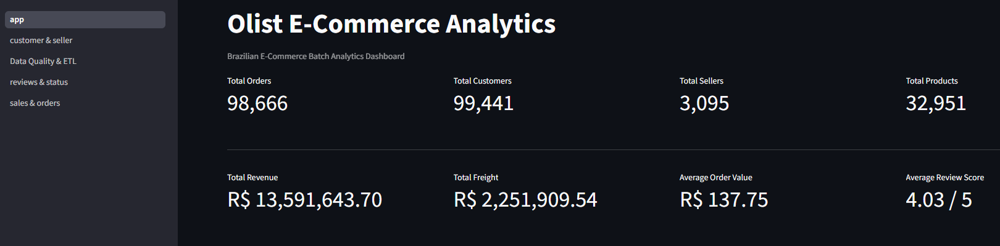

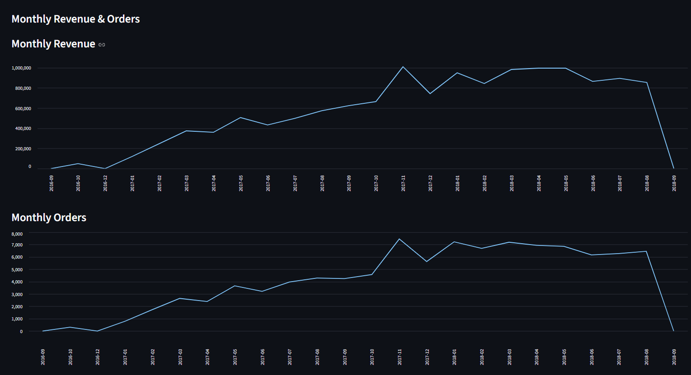

### Sales & Orders

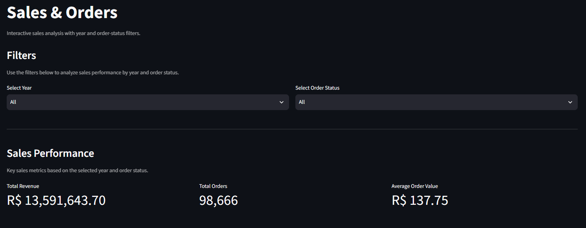
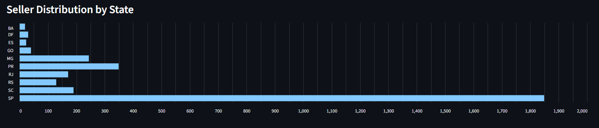
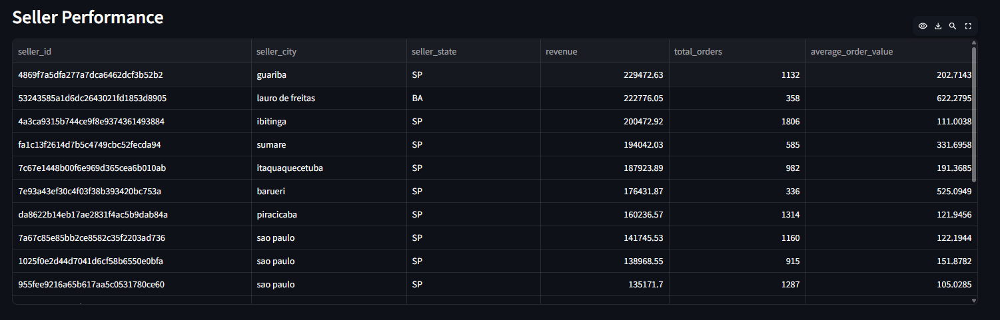
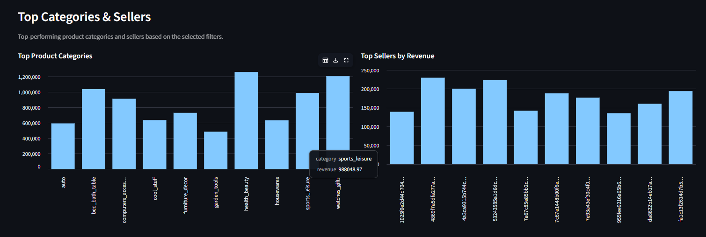

### Customer & Seller

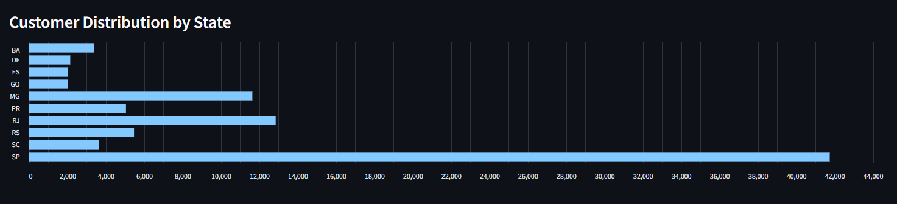
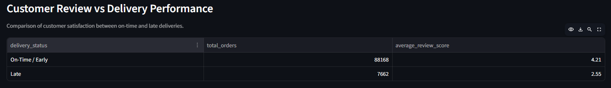

### Reviews & Status

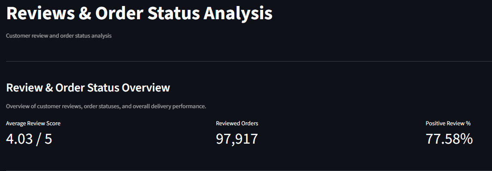
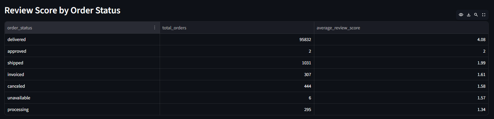

### Delivery Analysis

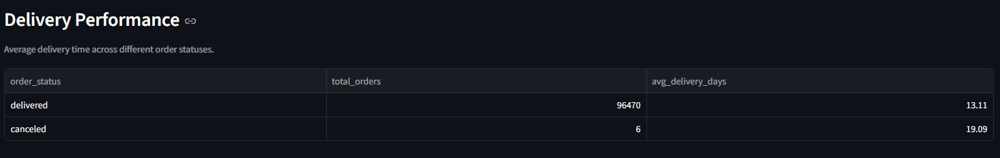
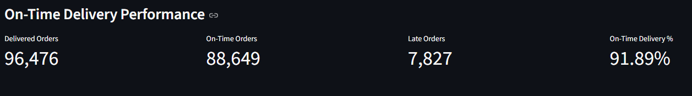

---

# 🔮 Future Improvements

The current project focuses on a reliable batch ETL architecture.

Potential future enhancements include:

* Incremental data loading
* Slowly Changing Dimensions (SCD)
* Automated data quality testing
* Pipeline orchestration using Apache Airflow
* dbt-based transformation layer
* PySpark-based distributed processing
* CI/CD pipeline using GitHub Actions
* Automated pipeline monitoring
* Data lineage
* Cloud object storage integration
* Partitioning and indexing optimization
* Automated alerting and failure notifications

---

# 🧠 What I Learned

Building this project provided practical experience with:

* Designing an end-to-end ETL pipeline
* Working with multi-table e-commerce datasets
* Building staging and warehouse layers
* Designing a star schema
* Defining fact-table grain
* Handling duplicates and one-to-many relationships
* Aggregating transactional data
* Connecting Python applications to PostgreSQL
* Managing environment variables and secrets
* Building analytics applications
* Deploying data-driven applications to the cloud
* Using Git/GitHub for version control

---

# 👨‍💻 Author

## Shubham Tyagi

**Aspiring Data Engineer | Python | SQL | PostgreSQL | ETL | Data Warehousing | Cloud**

* 💼 [LinkedIn](https://www.linkedin.com/in/shubham-tyagi-947b49400/)
* 💻 [GitHub](https://github.com/ShubhTyagi1616)
* 🚀 [Live Project](https://olist-batchflow-nthhq7wksqr2eugqjnrqtr.streamlit.app)
* 📂 [Olist-BatchFlow Repository](https://github.com/ShubhTyagi1616/Olist-BatchFlow)

---

# ⭐ If you found this project useful

Feel free to explore the repository, review the architecture, and connect with me on LinkedIn.

**Built to demonstrate practical Data Engineering skills through an end-to-end e-commerce data pipeline.**
